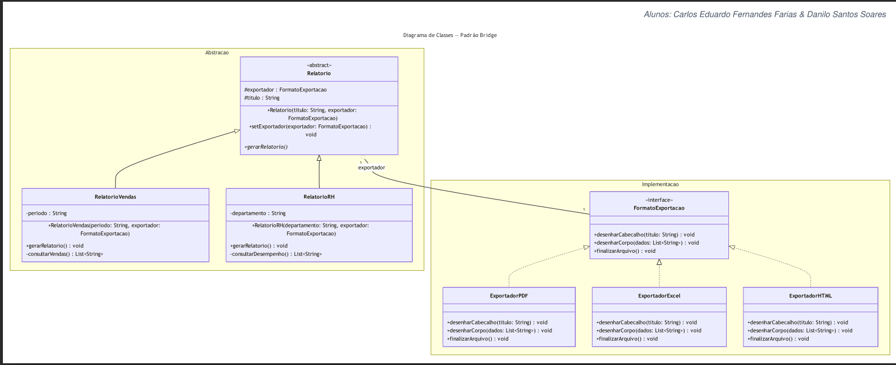
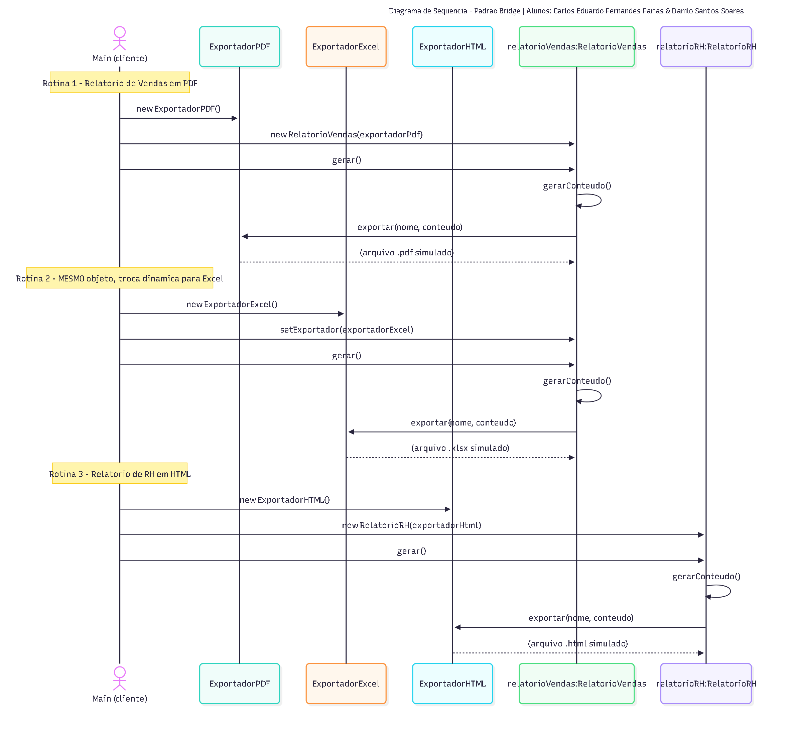

# PatternBridge — Módulo de Relatórios (Padrão Bridge)

**Alunos:** Carlos Eduardo Fernandes Farias & Danilo Santos Soares

Projeto acadêmico da disciplina de Padrões de Projeto (TechFatec). Implementa o
**padrão de projeto Bridge (GoF, estrutural)** para desacoplar **tipos de
relatório** (Vendas, RH, ...) de **formatos de exportação** (PDF, Excel,
HTML, ...), permitindo que ambas as hierarquias evoluam de forma
independente, sem explosão combinatória de subclasses e em conformidade com
o **Princípio Aberto/Fechado (OCP)** do SOLID.

---

## 1. Contexto e problema

O sistema legado de BI da TechFatec gerava **apenas** o "Relatório de Vendas"
em **PDF**. O novo requisito de negócio exige:

1. Um novo tipo de relatório: **"Relatório de Desempenho de RH"**;
2. Que **todos** os relatórios (atuais e futuros) possam ser exportados em
   **PDF**, **Excel (XLSX)** e **HTML**.

Se cada combinação (tipo × formato) virasse uma subclasse
(`RelatorioVendasPDF`, `RelatorioVendasExcel`, `RelatorioRHHTML`, ...), o
número de classes cresceria multiplicativamente a cada novo tipo de
relatório ou novo formato — a clássica **explosão de subclasses** que o
Bridge existe para evitar.

## 2. Por que o padrão Bridge resolve isso

O Bridge separa uma hierarquia em dois eixos independentes:

- **Abstração**: *o que* o relatório representa (Vendas, RH, ...) e sua
  lógica de negócio (como montar o conteúdo).
- **Implementação**: *como* esse conteúdo é fisicamente exportado (PDF,
  Excel, HTML, ...).

A Abstração não herda da Implementação — ela **contém uma referência** a
ela (a "ponte") e delega o trabalho de exportação a esse objeto. Isso
significa que:

- Adicionar um **novo tipo de relatório** (ex.: Relatório Financeiro) exige
  apenas uma nova subclasse de `Relatorio`, sem tocar nos exportadores.
- Adicionar um **novo formato** (ex.: CSV) exige apenas uma nova classe que
  implemente `ExportadorRelatorio`, sem tocar em nenhum relatório existente.
- Isso é exatamente o **Princípio Aberto/Fechado**: o sistema fica aberto
  para extensão (novas classes) e fechado para modificação (código
  existente permanece intacto).
- O formato de exportação de um relatório já criado pode ser **trocado em
  tempo de execução**, simplesmente atribuindo outra implementação à ponte
  (ver Rotina 2 do script de validação).

## 3. Arquitetura de diretórios

```
PatternBridge/
├── src/
│   ├── abstracao/               → Hierarquia da Abstração (Bridge)
│   │   ├── Relatorio.java              (Abstraction)
│   │   ├── RelatorioVendas.java        (Refined Abstraction)
│   │   └── RelatorioRH.java            (Refined Abstraction)
│   │
│   ├── implementacao/           → Hierarquia da Implementação (Bridge)
│   │   ├── ExportadorRelatorio.java    (Implementor - interface)
│   │   ├── ExportadorPDF.java          (Concrete Implementor)
│   │   ├── ExportadorExcel.java        (Concrete Implementor)
│   │   └── ExportadorHTML.java         (Concrete Implementor)
│   │
│   └── cliente/                 → Script de validação
│       └── Main.java
│
├── docs/
│   └── diagramas/               → Diagramas de classe e sequência (imagens)
│       ├── diagrama-classes.png
│       └── diagrama-sequencia.png
│
├── .gitignore
└── README.md
```

Essa separação física reflete diretamente os dois eixos do padrão: qualquer
alteração em um dos pacotes não exige tocar no outro.

## 4. Diagrama de classes



**Leitura do diagrama:**
- `Relatorio` (Abstraction) e `ExportadorRelatorio` (Implementor) são os dois
  eixos independentes ligados pela associação `o--` (a "ponte").
- `RelatorioVendas` e `RelatorioRH` (Refined Abstractions) herdam apenas da
  Abstração — nunca dos exportadores.
- `ExportadorPDF`, `ExportadorExcel` e `ExportadorHTML` (Concrete
  Implementors) implementam apenas a interface `ExportadorRelatorio`.
- `Main` (cliente) é a única classe que conhece e instancia as
  implementações concretas, injetando-as via construtor nas classes de
  relatório.

## 5. Diagrama de sequência (script de validação)



**Ponto-chave da Rotina 2:** o objeto `relatorioVendas` **não é recriado**.
Apenas o objeto de implementação injetado nele é trocado em tempo de
execução via `setExportador(...)`, provando o desacoplamento entre a lógica
do relatório e o mecanismo de exportação.

## 6. Injeção de dependência

É **proibido** instanciar um exportador concreto (`new ExportadorPDF()`,
`new ExportadorExcel()`, `new ExportadorHTML()`) dentro das classes de
relatório. Essa regra é cumprida da seguinte forma:

- `Relatorio` (e suas subclasses `RelatorioVendas`/`RelatorioRH`) dependem
  apenas da abstração `ExportadorRelatorio` (interface).
- A implementação concreta é **sempre** criada fora da hierarquia de
  relatórios — em [`Main.java`](src/cliente/Main.java) — e **injetada via
  construtor**:

```java
ExportadorRelatorio exportadorPdf = new ExportadorPDF();
Relatorio relatorioVendas = new RelatorioVendas(exportadorPdf); // injeção via construtor
```

- A troca em tempo de execução (Rotina 2) usa um *setter* (`setExportador`)
  que recebe a nova implementação já pronta — novamente, sem `new` dentro da
  classe de relatório.

## 7. Como compilar e executar

Pré-requisito: JDK 17+ instalado (`javac -version`).

```bash
# a partir da raiz do projeto
javac -d out $(find src -name "*.java")
java -Dfile.encoding=UTF-8 -Dstdout.encoding=UTF-8 -cp out cliente.Main
```

No Windows (PowerShell), caso os acentos não apareçam corretamente no
console, ajuste a página de código antes de rodar:

```powershell
chcp 65001
javac -d out (Get-ChildItem -Recurse -Filter *.java -Path src).FullName
java -Dfile.encoding=UTF-8 -Dstdout.encoding=UTF-8 -cp out cliente.Main
```

### Saída esperada (resumo)

1. **Rotina 1** — gera o Relatório de Vendas em PDF.
2. **Rotina 2** — reutiliza o **mesmo** objeto de Relatório de Vendas e o
   exporta em Excel, provando a troca dinâmica de implementação.
3. **Rotina 3** — gera o novo Relatório de Desempenho de RH em HTML.

## 8. Extensibilidade (prova do OCP)

| Cenário                                   | O que muda                                              | O que **não** muda                          |
|--------------------------------------------|----------------------------------------------------------|----------------------------------------------|
| Novo tipo de relatório (ex.: Financeiro)   | 1 nova classe em `abstracao/` estendendo `Relatorio`     | Nenhum exportador é alterado                  |
| Novo formato (ex.: CSV)                    | 1 nova classe em `implementacao/` implementando `ExportadorRelatorio` | Nenhuma classe de relatório é alterada |
